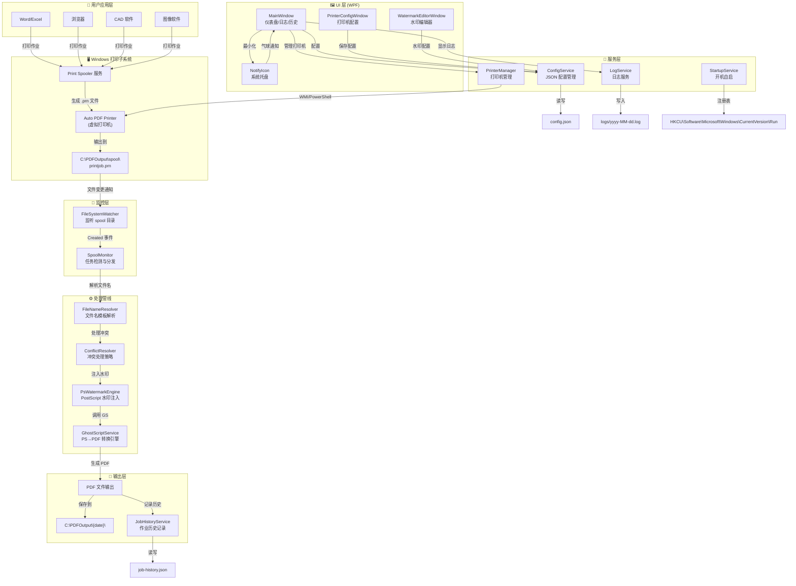
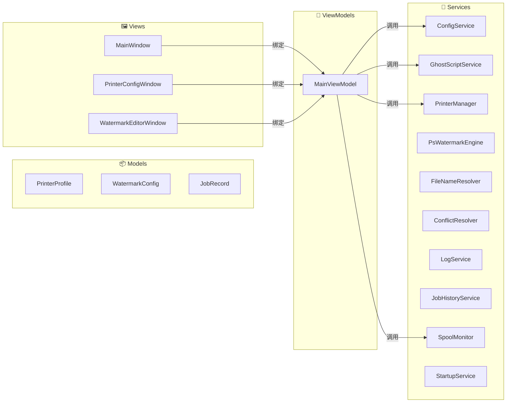
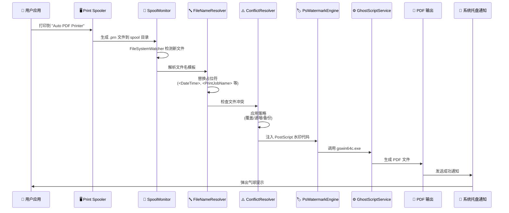

# PdfAutoPrint Pro - 系统架构图

## 整体架构

```mermaid
graph TD
    subgraph UserApp["👤 用户应用层"]
        WORD[Word/Excel]
        BROWSER[浏览器]
        CAD[CAD 软件]
        IMAGE[图像软件]
    end

    subgraph Windows["🖥️ Windows 打印子系统"]
        SPOOLER[Print Spooler 服务]
        VPRINTER["Auto PDF Printer<br/>(虚拟打印机)"]
        PORT["C:\PDFOutput\spool\<br/>printjob.prn"]
    end

    subgraph Monitor["📡 监控层"]
        FSW[FileSystemWatcher<br/>监听 spool 目录]
        SPOOLMON[SpoolMonitor<br/>任务检测与分发]
    end

    subgraph Pipeline["⚙️ 处理管线"]
        FNR[FileNameResolver<br/>文件名模板解析]
        CR[ConflictResolver<br/>冲突处理策略]
        PWE[PsWatermarkEngine<br/>PostScript 水印注入]
        GSS[GhostScriptService<br/>PS→PDF 转换引擎]
    end

    subgraph Output["📄 输出层"]
        PDFOUT[PDF 文件输出]
        OUTDIR["C:\PDFOutput\{date}\"]
        JOBHIST[JobHistoryService<br/>作业历史记录]
    end

    subgraph UI["🖼️ UI 层 (WPF)"]
        MAIN[MainWindow<br/>仪表盘/日志/历史]
        PCW[PrinterConfigWindow<br/>打印机配置]
        WEW[WatermarkEditorWindow<br/>水印编辑器]
        TRAY[NotifyIcon<br/>系统托盘]
    end

    subgraph Services["🔧 服务层"]
        CS[ConfigService<br/>JSON 配置管理]
        LS[LogService<br/>日志服务]
        PM[PrinterManager<br/>打印机管理]
        SS[StartupService<br/>开机自启]
    end

    %% 数据流
    WORD -->|打印作业| SPOOLER
    BROWSER -->|打印作业| SPOOLER
    CAD -->|打印作业| SPOOLER
    IMAGE -->|打印作业| SPOOLER

    SPOOLER -->|生成 .prn 文件| VPRINTER
    VPRINTER -->|输出到| PORT
    PORT -->|文件变更通知| FSW
    FSW -->|Created 事件| SPOOLMON

    SPOOLMON -->|解析文件名| FNR
    FNR -->|处理冲突| CR
    CR -->|注入水印| PWE
    PWE -->|调用 GS| GSS
    GSS -->|生成 PDF| PDFOUT
    PDFOUT -->|保存到| OUTDIR
    PDFOUT -->|记录历史| JOBHIST

    %% UI 交互
    MAIN -->|配置| CS
    MAIN -->|显示日志| LS
    MAIN -->|管理打印机| PM
    PCW -->|保存配置| CS
    WEW -->|水印配置| CS
    MAIN -->|最小化| TRAY
    TRAY -->|气球通知| MAIN

    %% 服务交互
    CS -->|读写| CONFIG_FILE[config.json]
    JOBHIST -->|读写| HIST_FILE[job-history.json]
    LS -->|写入| LOG_FILE[logs/yyyy-MM-dd.log]
    PM -->|WMI/PowerShell| VPRINTER
    SS -->|注册表| REG[HKCU\Software\Microsoft\Windows\CurrentVersion\Run]
```

## 项目结构

```mermaid
graph LR
    subgraph Models["📦 Models"]
        PP[PrinterProfile]
        WC[WatermarkConfig]
        JR[JobRecord]
    end

    subgraph Services["🔧 Services"]
        CS2[ConfigService]
        GS2[GhostScriptService]
        PM2[PrinterManager]
        PWE2[PsWatermarkEngine]
        FNR2[FileNameResolver]
        CR2[ConflictResolver]
        LS2[LogService]
        JHS[JobHistoryService]
        SM[SpoolMonitor]
        SS2[StartupService]
    end

    subgraph ViewModels["🎯 ViewModels"]
        MVMM[MainViewModel]
    end

    subgraph Views["🖼️ Views"]
        MW[MainWindow]
        PC[PrinterConfigWindow]
        WE[WatermarkEditorWindow]
    end

    MVMM -->|调用| CS2
    MVMM -->|调用| GS2
    MVMM -->|调用| PM2
    MVMM -->|调用| SM
    MW -->|绑定| MVMM
    PC -->|绑定| MVMM
    WE -->|绑定| MVMM
```

## 数据流 - 打印作业处理流程

```mermaid
sequenceDiagram
    participant User as 👤 用户应用
    participant Spooler as 🖥️ Print Spooler
    participant Monitor as 📡 SpoolMonitor
    participant Resolver as 🔤 FileNameResolver
    participant Conflict as ⚠️ ConflictResolver
    participant Watermark as 🏷️ PsWatermarkEngine
    participant GS as ⚙️ GhostScriptService
    participant Output as 📄 PDF 输出
    participant Notify as 🔔 系统托盘通知

    User->>Spooler: 打印到 "Auto PDF Printer"
    Spooler->>Monitor: 生成 .prn 文件到 spool 目录
    Monitor->>Monitor: FileSystemWatcher 检测新文件
    Monitor->>Resolver: 解析文件名模板
    Resolver->>Resolver: 替换占位符<br/>(<DateTime>, <PrintJobName> 等)
    Resolver->>Conflict: 检查文件冲突
    Conflict->>Conflict: 应用策略<br/>(覆盖/递增/备份)
    Conflict->>Watermark: 注入 PostScript 水印代码
    Watermark->>GS: 调用 gswin64c.exe
    GS->>Output: 生成 PDF 文件
    Output->>Notify: 发送成功通知
    Notify->>User: 弹出气球提示
```
